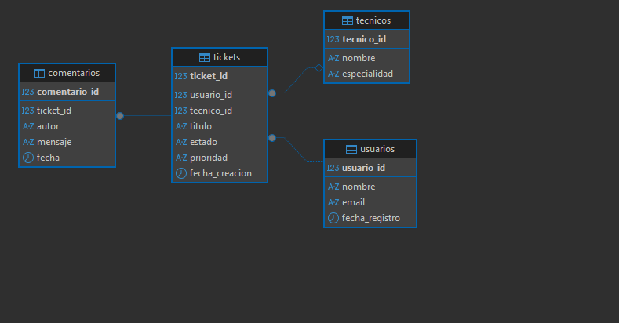

Romero Romero Angel Adrian 8A

# Sistema de Gestión de Tickets de Soporte Técnico (HelpDesk)

## 1. Descripción Breve del Caso y Objetivo
Este proyecto consiste en el diseño e implementación de una base de datos relacional orientada a la gestión de soporte técnico (HelpDesk). Su objetivo principal es centralizar el registro de usuarios, la creación y seguimiento de tickets de soporte, la asignación de personal técnico especializado y el historial de comentarios asociados a cada caso, garantizando la consistencia transaccional y la trazabilidad de la información.

---

## 2. Modelo Relacional
El modelo relacional consta de 4 tablas principales interconectadas mediante llaves primarias y foráneas (`PRIMARY KEY` y `FOREIGN KEY`):
* **`usuarios`**: Registra a los clientes o empleados que reportan incidencias.
* **`tecnicos`**: Almacena el personal encargado de resolver los tickets y su especialidad.
* **`tickets`**: Guarda los datos principales de la incidencia (título, descripción, prioridad, estado, usuario solicitante y técnico asignado).
* **`comentarios`**: Almacena el historial de seguimiento y las respuestas asociadas a cada ticket.


## 3. Requisitos para Ejecutar el Proyecto
* **PostgreSQL** (versión 12 o superior).
* **DBeaver** o extensión de PostgreSQL en **VS Code**.
* Terminal del sistema (Command Prompt / PowerShell) con las utilidades `pg_dump` y `pg_restore` agregadas a las variables de entorno (`PATH`).
* Git instalado para el control de versiones.

---

## 4. Orden de Ejecución de los Scripts SQL
Para desplegar la base de datos de forma correcta, los archivos ubicados en la carpeta `sql/` deben ejecutarse en el siguiente orden secuencial:

1. `sql/01_creacion.sql`: Crea las tablas y define las restricciones de integridad.
2. `sql/02_datos.sql`: Inserta los registros iniciales de prueba.
3. `sql/03_usuarios_permisos.sql`: Crea los usuarios del sistema y asigna privilegios de seguridad.
4. `sql/04_consultas.sql`: Contiene consultas de análisis de datos (`JOINs`, agregaciones y métricas).
5. `sql/05_calidad_monitoreo.sql`: Revisa la calidad de los datos y el rendimiento de la base de datos.

---

## 5. Procedimientos de Respaldo, Restauración, Importación, Exportación y Automatización

### Respaldo y Restauración
* **Respaldo (`pg_dump`):**
  ```bash
  pg_dump -U postgres -d helpdesk_db -F c -b -v -f "C:/Users/Public/helpdesk_backup.dump"